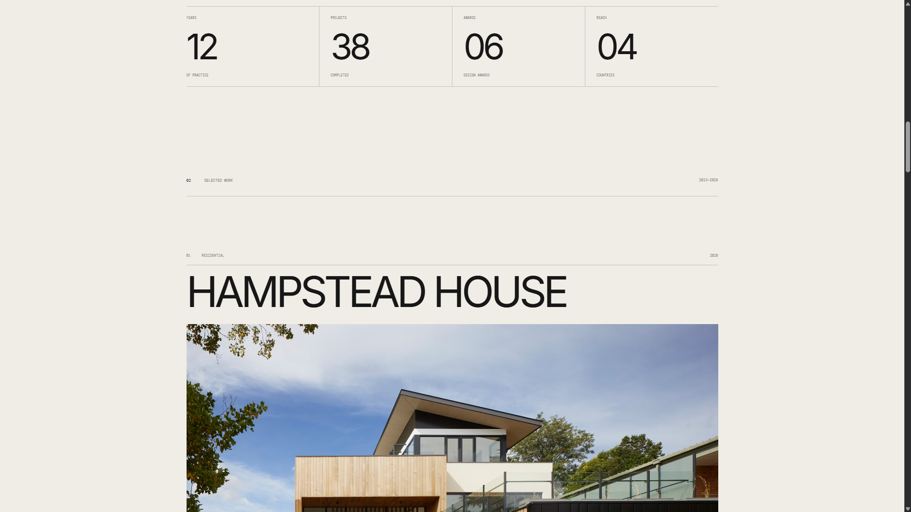

# NORTH/FORM

Editorial architecture and interiors website for a fictional independent studio based in London.

Created as a portfolio project with a focus on typography, asymmetric layouts, architectural photography and subtle interactions.

## Live Demo

**[View live website](https://zenviamediakontakt-hub.github.io/north-form/)**

## Preview



## About the project

NORTH/FORM is a fictional architecture and interiors practice based in London.

The website uses a minimal editorial direction inspired by contemporary architecture publications and design studios. The visual system is built around oversized typography, neutral colours, generous spacing and large-scale photography.

The interface intentionally avoids traditional button-heavy layouts. Navigation and interactions rely on typography, animated lines, project imagery and a custom project cursor.

## Features

- Responsive desktop and mobile layout
- Editorial architecture-inspired design
- Asymmetric project layouts
- Custom project cursor
- Scroll reveal animations
- Image parallax effects
- Numbered navigation
- Animated text links
- Mobile navigation
- Reduced-motion support
- Local AVIF image assets
- Custom favicon

## Technologies

- HTML5
- CSS3
- JavaScript
- Intersection Observer API
- GitHub Pages

No frameworks or UI libraries were used.

## Project structure

```text
north-form/
├── assets/
│   ├── images/
│   │   ├── hero.avif
│   │   ├── hampstead.avif
│   │   ├── frame-house.avif
│   │   ├── courtyard.avif
│   │   └── north-gallery.avif
│   └── preview.png
├── favicon.svg
├── index.html
├── style.css
├── script.js
└── README.md
```

## Running locally

No installation or build process is required.

Clone the repository and open:

```text
index.html
```

in your browser.

## Disclaimer

This is a fictional project created for portfolio purposes.

NORTH/FORM, its projects, statistics, addresses and contact information are demonstration content and do not represent a real architecture studio.
